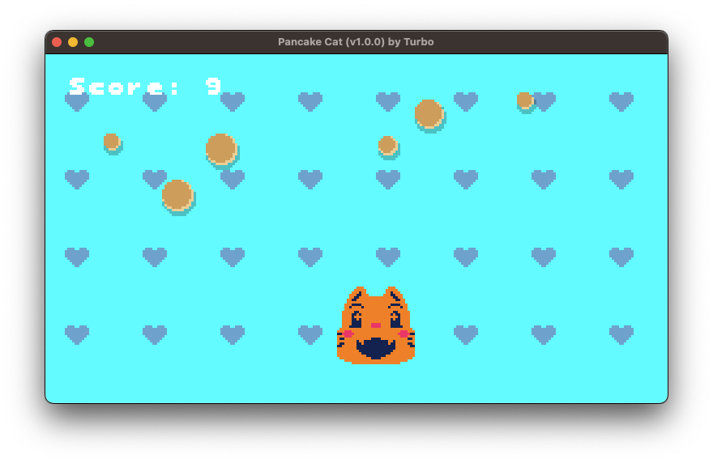

# Pancake Cat

#### Prerequisites

Before you begin, make sure you have`Turbo`installed and initialize a project `turbo init pancakegame` Also, create a sprites folder at the root of your Turbo project and add the required sprites: 
- heart.png: 
- munch_cat.png: 
- taco.png: 

The following code should be added in your `src/lib.rs` file. Remove the boilerplate code and replace with the following
#### Game Configuration  

The game configuration is where you define metadata and settings for your game.
```rust
// Define the game configuration using the turbo::cfg! macro
turbo::cfg! {r#"
    name = "Pancake Devourer"
    version = "1.0.0"
    author = "Turbo"
    description = "Catch falling pancakes!"
    [settings]
    resolution = [256, 144]
"#} 

```
- `name, version, author`: Basic information about your game.
- `description`: A short description of your game.
- `resolution`: The resolution of the game window.

#### Game State Initialization

The game state initialization sets up the initial state of your game, including the position of the cat, pancakes, and the current score.
```rust
// Define the game state initialization using the turbo::init! macro
turbo::init! {
    struct GameState {
        frame: u32,
        last_munch_at: u32,
        cat_x: f32,
        cat_y: f32,
        cat_r: f32,
        pancakes: Vec<struct Pancake {
            x: f32,
            y: f32,
            vel: f32,
            radius: f32,
        }>,
        score: u32,
    } = {
        Self {
            frame: 0,
            last_munch_at: 0,
            cat_x: 128.0,
            cat_y: 112.0,
            cat_r: 8.0,
            pancakes: vec![],
            score: 0,
        }
    }
}
```
- `frame`: The current frame number.
- `last_munch_at`: The frame when the cat last caught a pancake.
- `cat_x, cat_y`: The initial position of the cat.
- `cat_r`: The radius of the cat.
- `pancakes`: A vector containing the state of falling pancakes.
- `score`: The current score.

#### Game Loop

The game loop is the core of your game, handling user input, updating the game state, and rendering.
```rust
// Implement the game loop using the turbo::go! macro
turbo::go! {
    // Load the game state
    let mut state = GameState::load();

    // Handle user input
    if gamepad(0).left.pressed() {
        state.cat_x -= 2.;
    }
    if gamepad(0).right.pressed() {
        state.cat_x += 2.;
    }

    // Generate new pancakes at random intervals
    if rand() % 64 == 0 {
        // Create a new pancake with random attributes
        let pancake = Pancake {
            x: (rand() % 256) as f32,
            y: 0.0,
            vel: (rand() % 3 + 1) as f32,
            radius: (rand() % 10 + 5) as f32,
        };
        state.pancakes.push(pancake);
    }

    // Update pancake positions and check for collisions with the cat
    let cat_center = (state.cat_x + state.cat_r, state.cat_y + state.cat_r);
    state.pancakes.retain_mut(|pancake| {
        pancake.y += pancake.vel;

        // Check for collision with the cat
        let pancake_center = (pancake.x + pancake.radius, pancake.y + pancake.radius);

        // Calculate the distance between the cat and the pancake
        let dx = cat_center.0 - pancake_center.0;
        let dy = cat_center.1 - pancake_center.1;

        let distance = (dx * dx + dy * dy).sqrt();
        let radii_sum = state.cat_r + pancake.radius;
        let radii_diff = (state.cat_r - pancake.radius).abs();

        if radii_diff <= distance && distance <= radii_sum {
            // Cat caught the pancake
            state.score += 1;
            state.last_munch_at = state.frame;
            false // Remove the pancake from the game
        } else if pancake.y < 144. + (pancake.radius * 2.) {
            true // Keep the pancake in the game if it's within the screen
        } else {
            false // Remove the pancake if it's off-screen
        }
    });

    // Set the background color
    clear(0x00ffffff);

    // Draw a tiled background of moving sprites
    let frame = (state.frame as i32) / 2;
    for col in 0..9 {
        for row in 0..6 {
            let x = col * 32;
            let y = row * 32;
            let x = ((x + frame) % (272 + 16)) - 32;
            let y = ((y + frame) % (144 + 16)) - 24;
            sprite!("heart", x = x, y = y);
        }
    }

    // Draw a speech bubble when the cat eats a pancake
    if state.frame >= 64 && state.frame.saturating_sub(state.last_munch_at) <= 60 {
        rect!(w = 30, h = 10, x = state.cat_x as i32 + 32, y = state.cat_y as i32);
        circ!(d = 10, x = state.cat_x as i32 + 28, y = state.cat_y as i32);
        rect!(w = 10, h = 5, x = state.cat_x as i32 + 28, y = state.cat_y as i32 + 5);
        circ!(d = 10, x = state.cat_x as i32 + 56, y = state.cat_y as i32);
        text!("MUNCH!", x = state.cat_x as i32 + 33, y = state.cat_y as i32 + 3, font = Font::S, color = 0x000000ff);
    }

    // Draw the cat
    sprite!("munch_cat", x = (state.cat_x - state.cat_r) as i32, y = (state.cat_y - 4.) as i32, fps = fps::FAST);

    // Draw the falling pancakes
    for pancake in &state.pancakes {
        circ!(x = pancake.x as i32, y = pancake.y as i32 + 1, d = (pancake.radius + 2.) as u32, fill = 0x000000aa); // Render the pancakes
        circ!(x = pancake.x as i32, y = pancake.y as i32, d = (pancake.radius + 1.) as u32, fill = 0xf4d29cff); // Render the pancakes
        circ!(x = pancake.x as i32, y = pancake.y as i32, d = pancake.radius as u32, fill = 0xdba463ff); // Render the pancakes
    }

    // Draw the score
    text!(&format!("Score: {}", state.score), x = 10, y = 10, font = Font::L, color = 0xffffffff); // Render the score

    // Uncomment to print game state for debugging
    // text!(&format!("{:#?}", state), y = 24);

    // Save game state for the next frame
    state.frame += 1;
    state.save();
}
```

- `gamepad(0).left.pressed(), gamepad(0).right.pressed()`: Handling left and right movements of the cat.
- Generating new pancakes at random intervals.
- Updating pancake positions and checking for collisions with the cat.
- Rendering the game elements and updating the score.
- Saving the game state for the next frame.

#### Result
 After running `turbo-cli run -w .`



?>  If you update sprites while your game is running, Turbo will immediately show the changes. Just be sure to restart Turbo when adding new sprites. Also using the keyboard shortcut cmd+r / ctrl+r will reset your game to its initial state.

