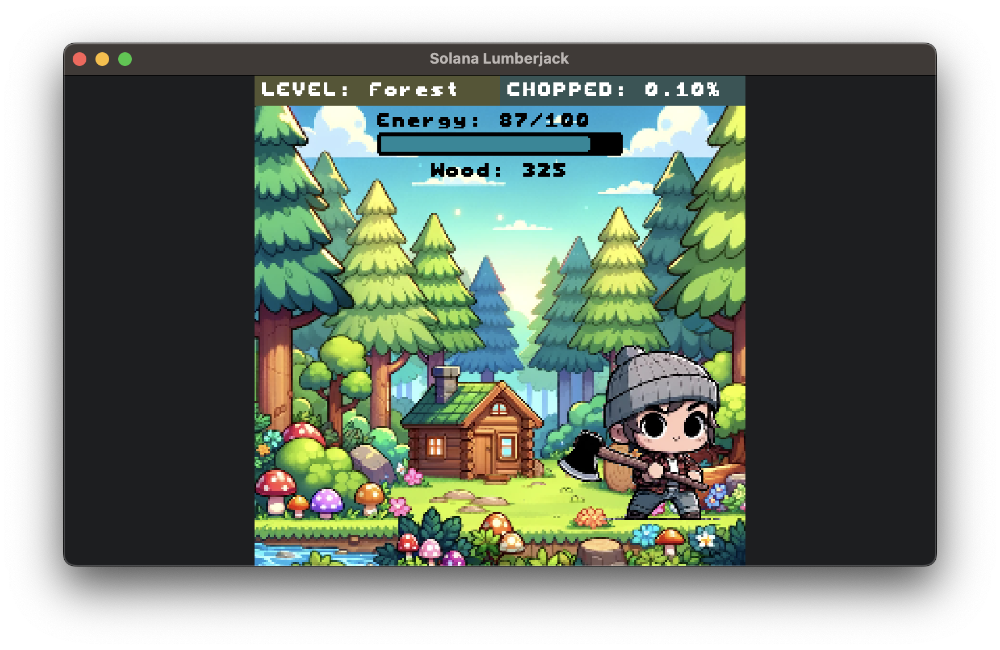

# Solana Lumberjack



A fully on-chain game where you chop wood. LFG 😤

- The Turbo game code is located in this directory
- The Solana Lumberjack program code is located in the `solana` directory

## Development

**Before continuing make sure you [setup your local Solana development environment](https://solana.com/developers/guides/getstarted/setup-local-development).**

You may choose to develop your game with the Solana Lumberjack program on devnet or deploy it locally depending on your needs:

<details>
<summary><strong>Using Devnet</strong></summary>

If you want to focus on your game code and have no intention of modifying the Solana lumberjack program, you can follow the steps in this section.

1. **Configuration**

A version of the lumberjack prorgam is deployed on Solana devnet with the program ID `HvGnquJPQ37WpwoCoByDe7bbaWSoZyQMsj9iTtHat6xo`. To interact with it, update your configuration in `src/lib.rs` to the following:

```rust
turbo::cfg! {r#"
    name = "Solana Lumberjack"
    [settings]
    resolution = [256, 256]
    [solana]
    http-rpc-url = "http://api.devnet.solana.com"
    ws-rpc-url = "wss://api.devnet.solana.com"
"#}
```

2. **Get Devnet Sol**

Be sure to airdrop devnet sol to your local account:

```
solana airdrop 5 -u devnet
```

3. **Run your game**

```
TURBO_SOL_SIGNER=<YOUR_BASE58_ACCOUNT_PRIVATE_KEY> turbo run -w .
```

</details>

<details>
<summary><strong>Using Localhost</strong></summary>

1. **Configuration**

Ensure your `turbo::cgf!` Solana rpc urls point towards `localhost`:

```rust
turbo::cfg! {r#"
    name = "Solana Lumberjack"
    [settings]
    resolution = [256, 256]
    [solana]
    http-rpc-url = "http://localhost:8899"
    ws-rpc-url = "ws://localhost:8900"
"#}
```
 
2. **Run Your Local Solana Validator**

```rust
solana-test-validator
```

3. **Build & Deploy the Program**

After you run your local validator, you need to deploy the lumberjack program locally
In the solana-lumberjack/solana/lumberjack dir, run this:

```
cargo build-sbf && solana program deploy target/deploy/lumberjack.so --program-id lumberjack-keypair.json
```

After running, that should dump something like the following:

```
Error: Function _ZN112_$LT$solana_program..instruction..InstructionError$u20$as$u20$solana_frozen_abi..abi_example..AbiEnumVisitor$GT$13visit_for_abi17hb025dbcd5ce47bc7E Stack offset of 4584 exceeded max offset of 4096 by 488 bytes, please minimize large stack variables
    Finished release [optimized] target(s) in 0.23s
Program Id: HvGnquJPQ37WpwoCoByDe7bbaWSoZyQMsj9iTtHat6xo
```

**Note**: Using the `program-id` flag when deploying is important as it will ensure you get a consistent program id when deploying the program (`HvGnquJPQ37WpwoCoByDe7bbaWSoZyQMsj9iTtHat6xo`).

4. **Run your game**

```
TURBO_SOL_SIGNER=<YOUR_BASE58_ACCOUNT_PRIVATE_KEY> turbo run -w .
```

</details>

## Walkthrough

### Understanding the Game Code

The game code is structured around several key components:

- **Constants and Instructions**: `lumberjack::constants` and `lumberjack::instructions` define game rules and blockchain interactions.
- **State Management**: `lumberjack::state::player_data::PlayerData` manages player data, including progress and achievements.
- **Serialization**: Anchor uses `borsh::BorshDeserialize` for data serialization and deserialization between game states and the blockchain.
- **Solana Integration**: `turbo::solana` provides the tools needed to interact with the Solana blockchain, including data fetching and transaction signing.

### Game Initialization

- **Configuration**: The game's resolution and Solana RPC URLs are set in the `turbo::cfg!` macro. This is where you define the game's display settings and blockchain connection points.

- **Game Loop**: The `turbo::go!` macro kicks off the game loop. It clears the screen, sets up the level, and checks for player and game data. Depending on the data availability, it either starts the game, initializes player data, or shows an error screen.

### Screen Functions

- `start_game_screen`: This function displays the game's start screen. It shows the signer's public key and waits for the player to press start.
- `chopping_screen`: When player and game data are available, this screen allows players to chop wood by pressing start, simulating game action with a simple animation.
- `error_screen`: Displays errors related to data fetching, helping in debugging.


### Data Management

- Getting Player and Game Data: `get_player_data` and `get_game_data` functions fetch data from the blockchain, using public keys derived from the signer and level seed.
- Initializing and Updating Game State: `init_player_and_game` and `chop_tree` functions send transactions to the Solana blockchain to initialize or update the game state.
